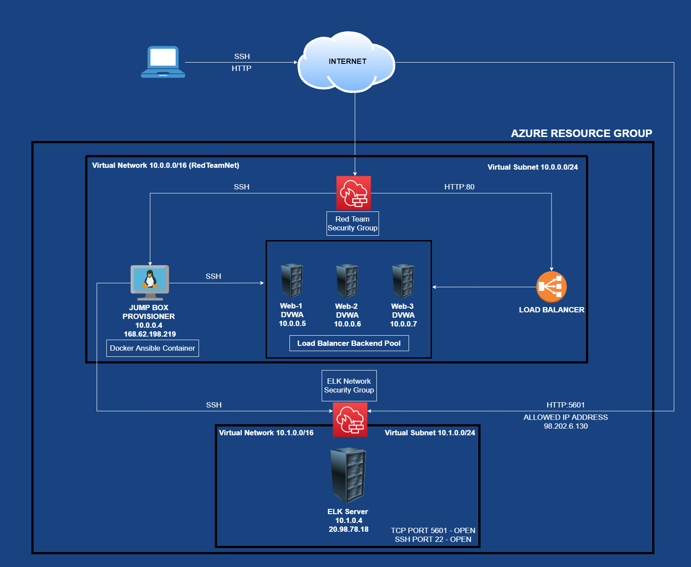
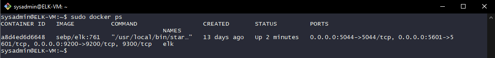

## Automated ELK Stack Deployment

The files in this repository were used to configure the network depicted below.

These files have been tested and used to generate a live ELK deployment on Azure. They can be used to either recreate the entire deployment pictured above. Alternatively, select portions of the '~/etc/Ansible/roles' file may be used to install only certain pieces of it, such as Filebeat.

/etc/ansible/[install-elk.yml]

This document contains the following details:
- Description of the Topology
- Access Policies
- ELK Configuration
  - Beats in Use
  - Machines Being Monitored
- How to Use the Ansible Build

### Description of the Topology

The main purpose of this network is to expose a load-balanced and monitored instance of DVWA, the D*mn Vulnerable Web Application.

Load balancing ensures that the application will be highly available, in addition to restricting traffic to the network.
- What aspect of security do load balancers protect? Load Balancers provides a defense from Denial of Service (DDoS) attack, by actively distributing traffic to the least burdoned Web Server.

- What is the advantage of a jump box? The Jump Box provides a way for a Network Administator to access the Network and perform administrative tasks while maintaining an extremely secure entry point.

Integrating an ELK server allows users to easily monitor the vulnerable VMs for changes to the log files and system traffic.
- What does Filebeat watch for? Filebeat motitors specified log files and sends them to Elasticsearch.

- What does Metricbeat record? Metricbeat is a lightweight shipper that will collect Operatating System and Services metrics that are running on the Web Server. Metricbeat will take these statistics and send them to Elasticsearch.

The configuration details of each machine may be found below.

| Name       | Function | IP Address | Operating System |
|------------|----------|------------|------------------|
| Jump Box   | Gateway  | 10.0.0.4   | Linux (Ubuntu)   |
| Web-1      | DVWA     | 10.0.0.5   | Linux (Ubuntu)   |
| Web-2      | DVWA     | 10.0.0.6   | Linux (Ubuntu)   |
| Web-3      | DVWA     | 10.0.0.7   | Linux (Ubuntu)   |
| ELK Server | ELK      | 10.1.0.4   | Linux (Ubuntu)   |

### Access Policies

The machines on the internal network are not exposed to the public Internet. 

Only the Jump Box machine can accept connections from the Internet. Access to this machine is only allowed from the following IP addresses: Personal IP Address

Machines within the network can only be accessed by SSH, Port 22.

- Which machine did you allow to access your ELK VM? The Jump Box from the Private IP Address of 10.0.0.4.

A summary of the access policies in place can be found in the table below.

| Name       | Publicly Accessible | Allowed IP Addresses |
|------------|---------------------|----------------------|
| Jump Box   | No                  | Personal             |
| Web-1      | No                  | 10.0.0.4             |
| Web-2      | No                  | 10.0.0.4             |
| Web-3      | No                  | 10.0.0.4             |
| Elk Server | No                  | 10.0.0.4 & Personal  |

### Elk Configuration

Ansible was used to automate configuration of the ELK machine. No configuration was performed manually, which is advantageous because...

- The advantage of having an Ansible configuration is the option of scaling horizontally with new virtual machines via a Playbook, rather than configuring each new virtual machine manually.

The playbook implements the following tasks:
- The Playbook header can specify a group of machines of your choosing, along with setting a specific remote user.
- The Playbook will install the following services: docker.io, python3-pip and the Python Docker Module. 
- The Playbook will download and launch a Docker Elk Container that will run the sebp/elk:761 image. The container will be started with the following published ports:
          -  5601:5601
          -  9200:9200
          -  5044:5044

The following screenshot displays the result of running `docker ps` after successfully configuring the ELK instance.

### Target Machines & Beats
This ELK server is configured to monitor the following machines:
'Web-1 10.0.0.5, Web-2 10.0.0.6, Web-3 10.0.0.7'

We have installed the following Beats on these machines:
- Filebeat
- Metricbeat

These Beats allow us to collect the following information from each machine:
- Filebeat collects data about specified log files. It allows Administrators to monitor those specified files for suspicious changes.

- Metricbeat collects Operatating System and Services metrics like CPU usage and system uptime. It makes it easy for Administrators to see specific metrics on the Virtual Machines on the Network.

### Using the Playbook
In order to use the playbook, you will need to have an Ansible control node already configured. Assuming you have such a control node provisioned: 

SSH into the control node and follow the steps below:
- Copy the [filebeat-config.yml] and [metricbeat-config.yml] file to '/etc/ansible/roles'.
- Update the configuration file to include the private IP Address of the Elk Server.
- Run the playbook, and navigate to the Elk Virtual Machine to check that the installation worked as expected.

- Which file is the playbook? [filebeat.yml] 
- Where do you copy it? ~/etc/ansible/roles/filebeat.yml
- Which file do you update to make Ansible run the playbook on a specific machine? You need to update the Ansible hosts from the Ansible Container '/etc/ansible/hosts' 
- How do I specify which machine to install the ELK server on versus which to install Filebeat on? From the [install-elk.yml] file.
- Which URL do you navigate to in order to check that the ELK server is running? 'http://[your_VM_Public_IP]:5601/app/kibana'